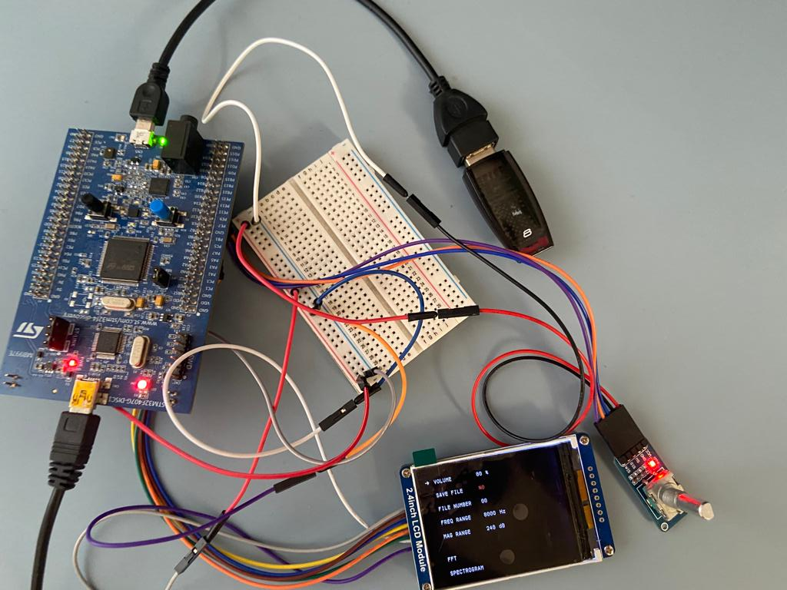
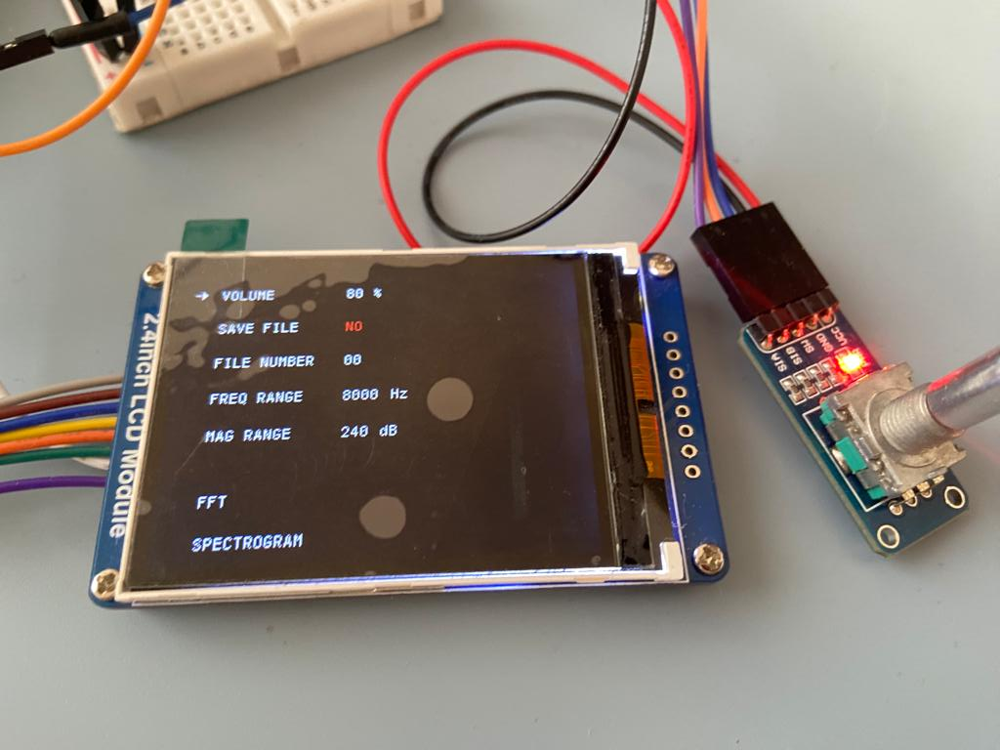
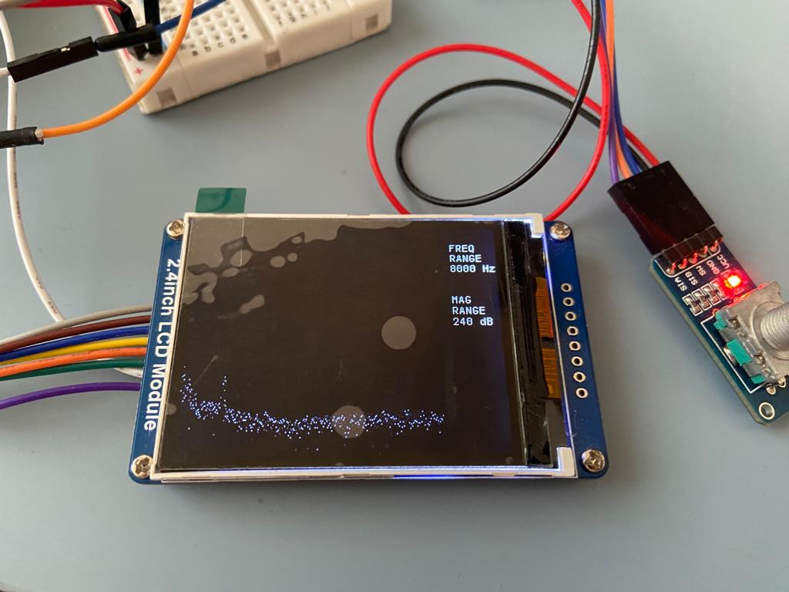
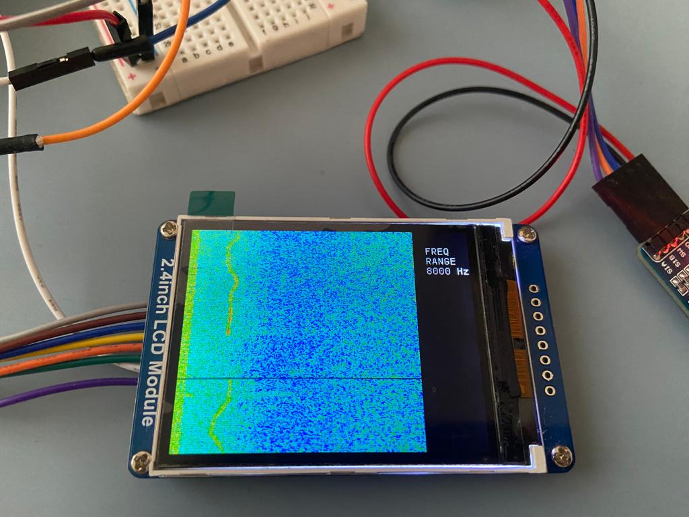

# STM32_electronic_stethoscope

**Project for the completion of first-cycle studies in biomedical engineering**

Device works as an electronic stethoscope performing and displaying results of fast Fourier transform.

List of components: 

  * STM32F407G-DISC1 (including MP45DT02 microphone and CS43L22 DAC)
  * ILI9341 controller connected to 240x320 TFT display
  * Encoder module

Classic stethoscope is connected to the MP45DT02 microphone on the board. Sound recorded in PDM is transferred to the memory of microcontroller via DMA. Conversion of sound from PDM to PCM is performed, then other DMA channel sends data (16-bit/16 kHz) to CS43L22 DAC connected to audio input. When enough data bytes are collected FFT of buffer is performed and displayed as regular FFT or spectrogram. By using an encoder user has an option of: 

* change volume of output sound
* save WAV file to USB flash drive
* change file name
* change frequency range of displayed analysis
* change magnitude range of displayed analysis (at this point magnitude values are not real because device is not                         calibrated)
* run regular FFT
* run spectrogram

Program was written in STM32CubeIDE.

**Device:** 

**Menu:** 

**FFT:** 

**Spectrogram:** 

**Resources:** 

* https://github.com/fboris/STM32Cube_FW_F4/tree/master/Projects/STM32F4-Discovery/Applications/Audio/Audio_playback_and_record
* https://github.com/MYaqoobEmbedded/STM32-Tutorials/tree/master/Tutorial%2028%20-%20I2S%20Audio%20Codec%20-%20CS43L22
* https://github.com/afiskon/stm32-ili9341/tree/master/Lib/ili9341